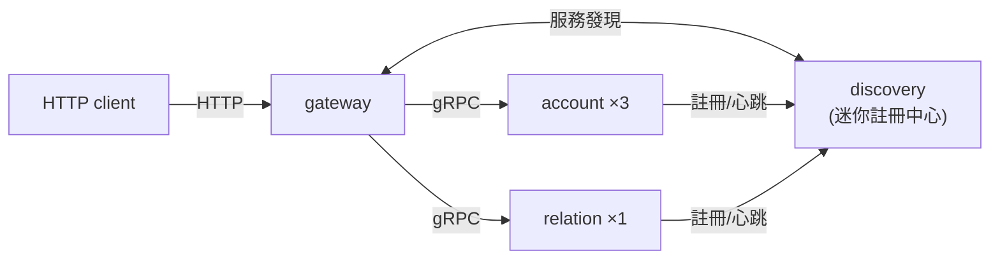

# grpc-governance-lab

> 實作 gRPC 服務治理層:服務發現、動態負載均衡、攔截器鏈、
> 錯誤碼透傳、Guard 自我保護、併發聚合。
>
> 設計思想參考 go-kratos 等開源服務治理框架,多數程式碼為獨立實作;
> 完整授權與歸屬見文末[授權與致謝](#授權與致謝)。


這是一個**學習載體 + 可現場 demo 的作品集**,不是生產框架。
價值一半在程式碼、一半在「[講清楚為什麼](docs/)」的設計文檔。

## 30 秒理解



- **discovery**:迷你註冊中心(註冊/心跳/長輪詢訂閱 + Guard 自我保護)
- **gateway**:HTTP→gRPC 網關,自訂 resolver + 動態 WRR balancer +
  errgroup 併發聚合,全程不寫死任何業務地址
- **治理層全在 `pkg/`**:ecode、interceptor、registry、resolver、balancer/wrr

## 能演示什麼(六個場景)

| # | 場景 | 證明的能力 |
|---|---|---|
| 1 | 新副本啟動後自動接到流量,全程不改設定 | 服務註冊與發現 |
| 2 | kill 一個副本,壓測錯誤率不飆升、流量自動轉移 | 故障轉移(連線層即時感知) |
| 3 | 對某副本注入延遲,流量占比自動從 33% 明顯下滑、恢復後回升 | 動態加權負載均衡 |
| 4 | 最內層回 `-404`,穿過 gRPC 與 gateway 後 HTTP 仍是 `{"code":-404}` | 錯誤碼跨邊界透傳 |
| 5 | 大量心跳同時消失,註冊中心進入自我保護、拒絕剔除 | Guard(類 Eureka self-preservation) |
| 6 | kill 註冊中心本身,業務流量不受影響(RPC 走直連) | 控制面/資料面分離 |

## 快速開始

```bash
docker compose up --build -d        # 起 discovery + account×3 + relation + gateway

# 正常聚合:併發呼叫 account + relation
curl 'http://localhost:8080/user/profile?id=1'
# → {"id":1,"name":"user-1","follower_count":100,"degraded":false}

# 看流量分布(demo 全程開著它觀察)
curl 'http://localhost:8080/debug/backends'
```

> **回應欄位**:gateway 併發問了兩個服務再合併,各欄位來源如下:
>
> - **`id` / `name`**:來自 account(主資料,假資料為 `user-{id}`)。
> - **`follower_count`**:來自 relation(次要資料,假資料為 `id×100`)。
> - **`degraded`**:`false` 代表兩個下游都成功、資料完整;若 relation 掛掉會降級成 `follower_count:-1`、`degraded:true`,但 HTTP 仍回 200(見下方 relation 降級)。

### 場景劇本(複製貼上即可重現)

<details><summary><b>白話說明</b>(新手點開)</summary>

下面每個場景都用**兩個視窗**配合演出:

- **第一個視窗是鏡頭**:每秒刷新一次,把 account 三台副本的即時權重(`ewt`)、被選中次數(`picks`)、延遲(`lat`)印出來。它只讀資料、不改任何東西,demo 全程開著。
- **第二個視窗是流量來源**:用一個無限迴圈一直打 `/user/profile`,模擬使用者持續在用——回應用 `>/dev/null` 丟掉,因為我們只要「有流量」這件事,實際變化看鏡頭視窗就好。沒有這股流量,後端是靜止的,鏡頭裡的數字不會動(要停按 `Ctrl-C`)。

架好這兩個視窗後,再做各場景的第三步製造故障,回到鏡頭看系統怎麼自動反應。

</details>

先在一個視窗開著觀測(需要 `jq`):

```bash
watch -n1 "curl -s http://localhost:8080/debug/backends | jq -c '.backends[]|select(.service==\"account\")|{addr,ewt:.effective_weight,picks,lat:.latency_ms}'"
```

再在另一個視窗持續壓測:

```bash
while true; do curl -s 'http://localhost:8080/user/profile?id=1' >/dev/null; done
```

**場景 1 — 服務發現**:新增第 4 個副本,幾秒內就出現在 `/debug/backends`、開始接流量(gateway 全程不重啟、不改設定)。

<details><summary><b>白話說明</b>(新手點開)</summary>

account 本來有 3 台副本,這個場景在 demo 跑著的時候直接再開第 4 台(account4),看它怎麼自己接上流量:

- **新副本主動報到**:account4 一啟動就跟註冊中心報到(指令裡的 `-discovery` 就是告訴它註冊中心在哪)。
- **gateway 自動感知**:gateway 一直訂閱著「account 有哪些節點」,幾秒內就收到「多了一台」,account4 便自動出現在 `/debug/backends`、開始分到流量。
- **全程零介入**:沒有人去重啟 gateway、也沒改任何設定檔。

**重點**:這就是「服務發現」——要加機器,把它開起來就好,系統會自己找到它、接上流量。(這也是場景 6「gateway 跟註冊中心要地址」的另一面:平常就靠它自動感知有誰上線。)

</details>

```bash
docker run -d --name account4 --network grpc-governance-lab_default ggl-demo \
  /usr/local/bin/demo -role account -addr :9000 -advertise account4:9000 \
  -admin :9090 -discovery http://discovery:7171
# 觀測視窗:account4 幾秒內出現並開始分到流量
```

**場景 2 — 故障轉移**(`deploy/chaos/scenario2-kill-replica.sh`):

<details><summary><b>白話說明</b>(新手點開)</summary>

account 服務有 3 台一樣的副本(account1/2/3),這個場景直接把其中一台(account2)整個關掉,模擬一台機器當機:

- **偵測**:系統在幾秒內發現 account2 不見了,自動把它從後端名單移除。
- **轉移**:原本要送給它的流量改由另外兩台承接。
- **使用者無感**:對外完全沒感覺,壓測期間零錯誤。

**重點**:一樣不需要人去改設定或重啟——壞掉一台,流量自己繞過去,這就是「故障轉移」。

</details>

```bash
docker kill account2
# 觀測視窗:account2 從列表消失,流量落到其餘副本;壓測零錯誤
```

**場景 3 — 動態加權**(`deploy/chaos/scenario3-latency.sh`):

<details><summary><b>白話說明</b>(新手點開)</summary>

account 服務同時跑著 3 台一樣的副本(account1/2/3),正常時流量平均分給三台(各約 33%)。這個場景故意讓其中一台(account1)每次回應都慢 150 毫秒——它還是答得出來,只是變慢:

- **察覺變慢**:負載平衡器發現 account1 最近比較慢。
- **自動降權**:就少分流量給它(占比掉到約 15~20%),把請求讓給另外兩台快的。
- **自動回升**:等延遲移除,約 30 秒內它的占比會慢慢回升。

**重點**:整個過程沒有人改設定、也沒有重啟,流量的重新分配是系統依即時延遲自己決定的——這就是「動態加權」。

</details>

```bash
curl -X POST 'http://localhost:9101/inject?delay=150'   # account1 注入 150ms 延遲
# 觀測視窗:account1 的 effective_weight 與 picks 占比明顯下滑(實測約掉到 15~20%)
curl -X POST 'http://localhost:9101/reset'              # 移除延遲
# 約 30 秒內(滑動視窗過期 + 重算)account1 權重回升
```

> 為何是 150ms 而非 200ms:gateway 聚合超時預設 200ms(`cmd/gateway -timeout`)。
> 注入的延遲若等於或超過超時,呼叫會在 deadline 邊界被取消(`code -498`),變成
> 「失敗降權」而非本場景要演示的「慢但成功、純靠延遲降權」。150ms 安全落在超時內、零錯誤。

**場景 4 — 錯誤碼透傳**:

<details><summary><b>白話說明</b>(新手點開)</summary>

account 服務啟動時在記憶體塞了一批假資料,只有 `id` 1~50 查得到,沒有資料庫,查 `id=9999` 就會一路觸發錯誤碼:

- **最內層產生**:account 找不到人,回了一個業務錯誤碼 `-404`(資源不存在)。
- **跨層透傳**:這個 `-404` 穿過 gRPC 一路傳回 gateway,不會在中間被吃掉變成籠統的「500 伺服器錯誤」。
- **gateway 照原碼回**:收到後照原碼回應,只是順手把它對應成 HTTP 404。

**重點**:錯誤的「原因」從最底層到最外層全程沒走鐘,前端拿到的 `-404` 就是 account 當初給的那個。

</details>

```bash
curl -i 'http://localhost:8080/user/profile?id=9999'
# → HTTP/1.1 404 Not Found
# → {"code":-404,"message":"資源不存在"}
```

**場景 5 — Guard 自我保護**(`deploy/chaos/scenario5-partition.sh`):

<details><summary><b>白話說明</b>(新手點開)</summary>

正常時每個服務每 30 秒跟註冊中心報一次平安,連續漏 3 次(90 秒)就被當成死掉、踢出名單。但「**一個**節點失聯」和「**一大票**節點同時失聯」意義完全不同:

- **大量同時失聯的真相**:比較可能是註冊中心**自己**的網路斷了,其實節點都還活著。
- **照規則全踢的後果**:訂閱者會拿到一份**空名單**、流量瞬間歸零,反而把「註冊中心的網路問題」放大成「全站掛掉」。
- **所以改為自我保護**:短時間內心跳大量消失時,註冊中心**乾脆停止剔除任何節點**,寧可錯留一份可能過期的名單,也不要錯殺。

這個場景把 4 個節點全部跟註冊中心斷網,約 90 秒後它就進入自保——查 `/fetch` 仍回完整 3 副本、一個都沒少;網路恢復後下個統計窗自動退出自保。

**重點**:少數失聯就剔除,大量同時失聯就先保留,避免把分區誤判成「全部都死了」。

</details>

```bash
# 把所有業務節點與 discovery 斷網(模擬分區,節點其實都活著)
for n in account1 account2 account3 relation; do
  docker network disconnect grpc-governance-lab_default $n
done
docker compose logs -f discovery     # 約 90s 後出現「Guard 進入自我保護」
curl 'http://localhost:7171/fetch?service=account'   # 仍回完整 3 副本,沒被剔除

# 恢復網路(Guard 下個統計窗自動退出自保)
for n in account1 account2 account3 relation; do
  docker network connect grpc-governance-lab_default $n
done
```

> 注意:`docker network disconnect`/`connect` 會重新分配容器 IP,比真實網路分區
> (丟包、IP 不變)更嚴苛——癒合後 gateway 的 gRPC 連線可能卡在舊 IP。此時補一個
> `docker compose restart gateway` 即可讓資料面完全恢復。本場景要證明的是「註冊中心
> 進入自我保護、拒絕剔除」,Guard 行為不受此影響。

**場景 6 — 控制面/資料面分離**(`deploy/chaos/scenario6-kill-discovery.sh`):

<details><summary><b>白話說明</b>(新手點開)</summary>

系統裡有兩條路:

- **註冊中心**(discovery,控制面):負責記錄「哪些服務在線上、地址是多少」。gateway 只在一開始跟它問一次地址,問到就記在自己身上。
- **業務流量**(資料面):gateway 直接連 account/relation 送請求,根本不經過註冊中心。

這個場景把註冊中心整個關掉,結果業務流量完全不受影響(壓測 0 失敗):因為 gateway 還記得地址、後端也都活著,大家照常直連。等註冊中心重啟,服務會自動重新報到、gateway 也自動恢復訂閱,不必有人手動處理。

**重點**:註冊中心掛掉只是「暫時無法感知有沒有新增/移除服務」,不會讓正在跑的業務中斷——這就是「控制面」和「資料面」分開的好處。

</details>

```bash
docker kill discovery
# 壓測視窗:業務流量不受影響(RPC 走直連,不經註冊中心)
docker start discovery        # 重啟後服務自動補註冊、gateway 訂閱自動恢復
```

**relation 降級**(聚合的次要依賴失敗):

<details><summary><b>白話說明</b>(新手點開)</summary>

`/user/profile` 會同時跟兩個服務要資料,但兩者重要性不一樣:

- **account 給名字**(主資料):查不到這份檔案就沒意義(回 404,就是場景 4)。
- **relation 給粉絲數**(次要資料):就算掛掉,也不該害整份檔案跟著失敗。

所以這個場景把 relation 殺掉後,gateway 照樣回傳 profile,只是把粉絲數填成 `-1`、並標記 `degraded:true` 誠實告訴前端「這個欄位暫時拿不到」,HTTP 還是 200。用 `-1` 而不是 `0`,是為了讓前端能分辨「真的 0 個粉絲」和「粉絲數查不到」。

**重點**:次要功能壞掉時,主功能還是能用,只是回一份標記為「不完整」的資料,而不是整個請求失敗。

</details>

```bash
docker kill relation
curl 'http://localhost:8080/user/profile?id=1'
# → {"id":1,"name":"user-1","follower_count":-1,"degraded":true}  (仍 HTTP 200)
```

`degraded` 只反映「次要依賴 relation 成不成功」,跟主資料 account 無關:

| account | relation | 結果 |
|---------|----------|------|
| 正常 | 正常 | `degraded:false`,資料完整 |
| 正常 | 失敗 | `degraded:true`,粉絲數回退 `-1`(本場景) |
| 失敗 | 不論 | 直接回錯誤碼(如 404),根本沒有 profile |

所以「一個正常、一個失敗」會不會是降級,得看失敗的是哪個:失敗的是 relation 才降級;失敗的是 account(主資料)就是整筆失敗、錯誤碼透傳。

## 模組與設計文檔對照

| `pkg/` 模組 | 職責 | 設計文檔 | 對照 go-kratos |
|---|---|---|---|
| `ecode` | 錯誤碼型別、註冊表、與 grpc status 互轉 | [01](docs/01-ecode.md) | `errors` |
| `interceptor` | server/client 攔截器鏈、超時遞減、metadata 透傳 | [02](docs/02-interceptor.md) | `middleware`、`transport/grpc` |
| `registry` + `internal/discovery` | 註冊中心 server 與 client SDK、Guard | [03](docs/03-discovery.md) | `registry` + Eureka self-preservation |
| `resolver` | 自訂 gRPC resolver、快取降級 | [04](docs/04-resolver.md) | `transport/grpc/resolver/discovery` |
| `balancer/wrr` | 動態加權輪詢、滑動視窗、觀測面 | [05](docs/05-balancer.md) | `selector/wrr`(計分公式直接改寫自此;另受 `selector/p2c` 的 EWMA/P2C 思路啟發) |
| `internal/gateway` | errgroup 併發聚合、降級、錯誤碼透傳 | [06](docs/06-aggregation.md) | BFF/聚合層 |

其他文件:[PLAN.md](PLAN.md)(完整規劃與驗收標準)、
[docs/CODE_QUALITY.md](docs/CODE_QUALITY.md)(程式碼品質規範)。

## 開發

```bash
make check     # = fmt + vet + lint + go test -race(提交前自查)
make proto     # 由 .proto 生成 Go 代碼(需 buf)
make cover     # pkg/ 覆蓋率報告(目標 ≥ 80%)
```

## 授權與致謝

本專案以 [Apache License 2.0](LICENSE) 釋出,僅供學習。

多數程式碼為理解設計思路後的獨立實作;但 `pkg/balancer/wrr` 的**動態加權
計分邏輯**(score 公式與冷啟動 clamp、smooth-WRR picker)**直接改寫自
[go-kratos](https://github.com/go-kratos/kratos)(Apache-2.0)的 warden/selector
WRR 實作**——這是對開源程式碼的合法引用,歸屬詳見 [NOTICE](NOTICE)。

其餘設計思想另參考公開資訊:[go-kratos](https://github.com/go-kratos/kratos)、
Google Dapper / SRE 論文、Netflix Eureka 文件。
